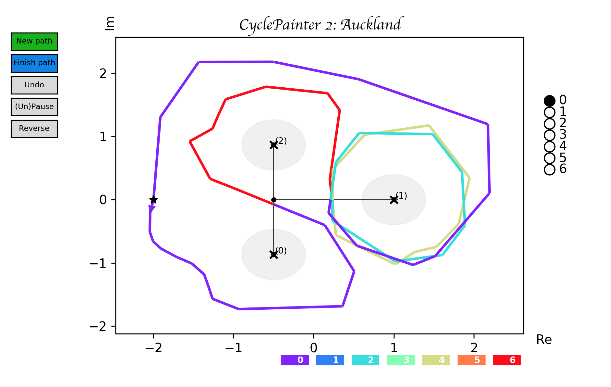

# CyclePainter  2: Auckland 

Tool for building custom paths on Riemann surfaces. Calculates the Period matrix
with respect to custom paths.

Extension of [abelfunctions](https://github.com/abelfunctions/abelfunctions) for Sage.

For a tutorial/example, see [Klein's curve.ipynb](Klein's curve.ipynb)
